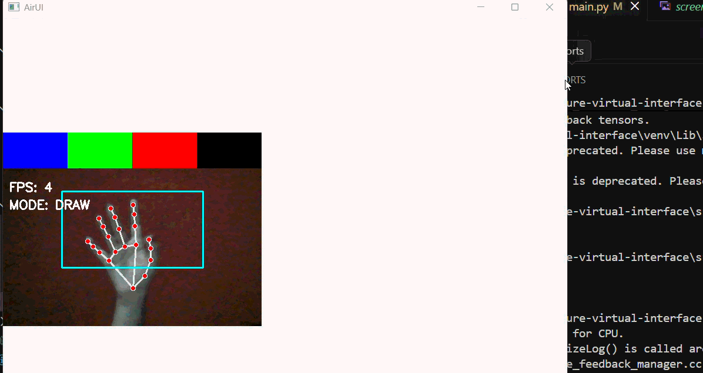
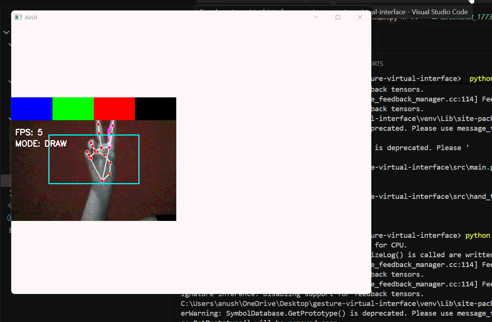
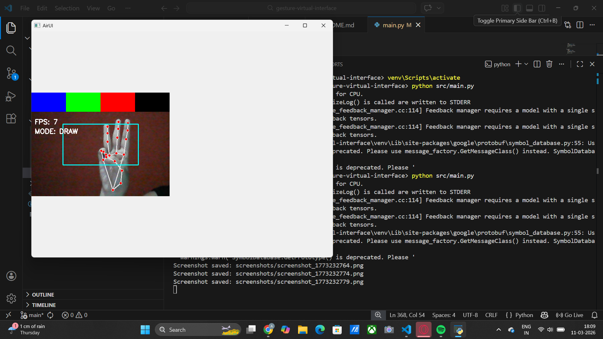

# AirUI — Computer Vision Powered Touchless Human-Computer Interaction Framework

AirUI is a real-time computer vision interface that enables users to interact with their computer using **natural hand gestures instead of traditional input devices**.

By combining **hand landmark detection, gesture recognition, and system automation**, AirUI converts a standard webcam into a **touchless interaction layer** capable of controlling the cursor, performing system actions, and enabling an interactive air-based drawing system.

The project demonstrates concepts from **Computer Vision, Human-Computer Interaction (HCI), Real-Time Systems, and AI-assisted interfaces**, showcasing how natural gestures can serve as an intuitive medium for interacting with digital systems.

AirUI explores the concept of **computer vision as an interaction layer for software systems**, where users interact with machines through physical motion rather than hardware peripherals.

---

# Demo








---

# Overview

Traditional computer interaction relies heavily on hardware devices such as mice, keyboards, and touchscreens. AirUI investigates an alternative paradigm — **gesture-driven interaction**, where a user communicates with the system through natural hand movements.

Using real-time hand tracking and gesture interpretation, AirUI translates spatial hand movements into meaningful computer actions. These gestures allow users to control the cursor, draw in mid-air, navigate applications, adjust system settings, and perform system operations without physically touching input devices.

The framework demonstrates how computer vision can be integrated into everyday computing environments to enable **touchless, intuitive, and responsive interaction models**.

This project emphasizes:

- Real-time gesture recognition
- Intuitive human-computer interaction
- Modular system design
- Practical applications of computer vision in user interfaces

AirUI serves as a prototype framework for exploring **next-generation interaction systems powered by computer vision**.

---

# Key Features

## Real-Time Hand Tracking

AirUI uses **MediaPipe's hand tracking pipeline** to detect and track **21 hand landmarks** from the webcam feed in real time.

These landmarks provide spatial information about finger positions and hand orientation, enabling the system to interpret gestures and motion patterns with high precision.

---

## Cursor Control

The mouse cursor can be controlled using the **index finger**.

Hand movement is mapped from camera coordinates to screen coordinates, allowing the cursor to follow finger motion smoothly.

To improve usability, AirUI implements **exponential cursor smoothing**, which reduces jitter and produces a stable pointer movement experience.

---

## Gesture-Based Click

Mouse clicks are triggered using a **pinch gesture between the thumb and index finger**.

When the distance between these landmarks falls below a defined threshold, the system registers the gesture as a click command.

A cooldown mechanism prevents repeated unintended clicks.

---

## AirCanvas Drawing System

AirUI includes an interactive **AirCanvas** that allows users to draw in mid-air using hand gestures.

Drawing mode is activated using a two-finger gesture.

### AirCanvas Features

- **Color Palette Selection**  
  Users can select drawing colors from a palette displayed at the top of the interface.

- **Brush Tool**  
  The brush tool allows users to draw continuous strokes in the air.

- **Eraser Tool**  
  Users can switch to an eraser gesture to remove previously drawn strokes.

- **Real-Time Drawing Overlay**  
  The drawing system renders strokes directly on top of the camera feed, providing immediate visual feedback.

---

## Screenshot Gesture

AirUI allows users to capture a screenshot using a **thumb and pinky pinch gesture**.

When this gesture is detected, the system automatically captures the current screen and stores the image.

---

## Gesture-Based System Control

AirUI supports motion gestures for performing operating system actions.

- Swipe Right -> Next application
- Swipe Left -> Previous application 
- Swipe Up -> Increase system volume
- Swipe Down -> Decrease system volume 
- Fist Gesture -> Close active application

These gestures allow users to navigate and control their system without interacting with physical input devices.

---

## Performance Monitoring

AirUI includes built-in **performance monitoring**.

The interface displays the **real-time FPS (frames per second)** of the vision pipeline, allowing users to monitor system responsiveness during execution.

---

# Gesture Map

| Gesture | Action |
|--------|--------|
| Index Finger | Cursor Control |
| Thumb + Index Pinch | Mouse Click |
| Index + Middle Fingers | Activate AirCanvas Drawing Mode |
| Eraser Gesture | Activate Eraser Tool |
| Thumb + Pinky Pinch | Screenshot Capture |
| Swipe Right | Next Application |
| Swipe Left | Previous Application |
| Swipe Up | Volume Up |
| Swipe Down | Volume Down |
| Fist Gesture | Close Active Window |

---

# System Architecture
```
Camera Input 
   ↓ 
Hand Landmark Detection (MediaPipe) 
   ↓ 
Gesture Recognition Engine 
   ↓ 
Action Controller 
   ↓ 
Operating System Interaction
```

---

# Project Structure
```
gestured-based-virtual-interface/
│
├── src/
│   ├── main.py
│   ├── hand_tracking.py
│   ├── gesture_logic.py
│   └── action_controller.py
│
├── experiments/
│   ├── test_finger_states.py
│   └── test_swipe_detection.py
│
├── screenshots/
│   ├── cursor_control.gif
│   ├── air_canvas.gif
│   |__ screenshot_1773232784.png
│   
│   
│
├── requirements.txt
├── README.md
└── .gitignore
```

# Tech Stack

- Python  
- OpenCV  
- MediaPipe  
- PyAutoGUI  
- NumPy  
- PyQt5  

---

# Installation

1. Clone the repository
```
git clone https://github.com/anushka583/gestured-based-virtual-interface.git⁠ 
cd gestured-based-virtual-interface
```

2. Install dependencies
```
pip install -r requirements.txt
```

3. Run the application
```
python src/main.py
```

---

# How It Works

1. The webcam captures a real-time video stream.  
2. MediaPipe detects hand landmarks in each frame.  
3. Gesture recognition algorithms interpret finger states and motion trajectories.  
4. The action controller maps recognized gestures to system commands.  
5. The system executes actions such as cursor movement, drawing, application control, and automation.

---

# Experiments

During development, experimental scripts were created to refine gesture detection strategies.

### Finger State Detection

Used to analyze finger landmark relationships and determine reliable conditions for detecting finger states.

### Swipe Detection

Used to analyze motion trajectories across multiple frames to detect directional swipe gestures.

*These experiments helped develop the final gesture recognition pipeline.*

---

# Future Improvements

Possible future extensions include:

- Multi-hand gesture recognition  
- AI-based gesture classification  
- Gesture confidence scoring  
- Gesture-controlled presentation systems  
- Fully immersive gesture-controlled desktop environments  

---

# Creator

**Anushka Sarkar**  
B.Tech CSE | Computer Vision & Software Systems

---

# License

*This project is released for educational and research purposes.*