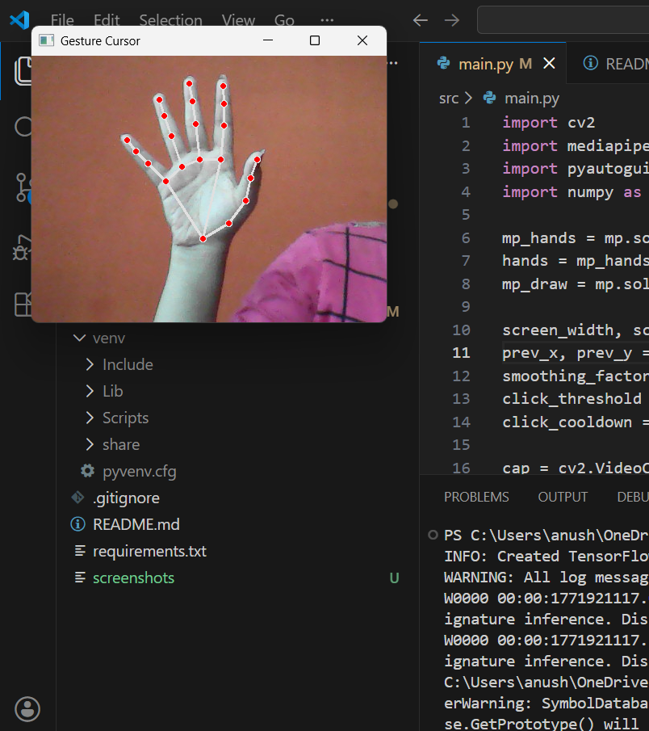

# Gesture-Based Virtual Air Interface System (Ongoing)

## Overview

This project implements a real-time gesture-driven human–computer interaction system using computer vision. The system enables OS-level control through hand tracking, supporting smooth cursor movement and gesture-based click detection.

The goal is to design a modular, scalable interaction framework that can evolve into a fully gesture-controlled interface system.


---

## Implemented Features

- Real-time hand landmark detection using MediaPipe
- Smooth cursor control with exponential smoothing
- Pinch-based click detection (thumb + index finger)
- Cooldown logic to prevent rapid unintended clicks
- Clean modular project structure for future expansion
- Proper resource handling and camera shutdown

---

## System Pipeline

1. Webcam frame capture (OpenCV)
2. Frame preprocessing (flip + RGB conversion)
3. Hand landmark detection (MediaPipe)
4. Feature extraction (index tip, thumb tip)
5. Screen coordinate mapping
6. Cursor smoothing (low-pass filtering)
7. Gesture-based click detection with debounce control
8. OS-level action execution via PyAutoGUI

---

## Core Concepts Implemented

- Real-time computer vision processing
- Landmark-based feature extraction
- Coordinate normalization and scaling
- Exponential smoothing for jitter reduction
- Gesture threshold detection
- State-based cooldown control

---

## Upcoming Features

- Air Canvas drawing mode
- Screenshot trigger gesture
- Application switching gesture
- Screen boundary constraint box
- FPS monitoring & performance logging

---

## Project Structure

```
gesture-virtual-inference/
│
├── screenshots/
│   └── cursor_control.png
│
├── experiments/
│   ├── test_finger_states.py
│   └── test_swipe_detection.py
│
├── src/
│   ├── main.py
│   ├── hand_tracking.py
│   ├── gesture_logic.py
│   └── action_controller.py
│
├── .gitignore
├── README.md
└── requirements.txt
```
## Demo - Cursor control

Real-time hand tracking with smoothed cursor movement and pinch-based click detection.



---


## Tech Stack

- Python
- OpenCV
- MediaPipe
- PyAutoGUI
- NumPy

---

## Long-Term Vision

The project aims to evolve into a robust gesture-controlled interaction framework integrating:

- Vision-based inference
- Intelligent gesture mapping
- Multi-mode interaction control
- Real-time performance optimization

This system is being developed incrementally with a focus on modular design and scalability.